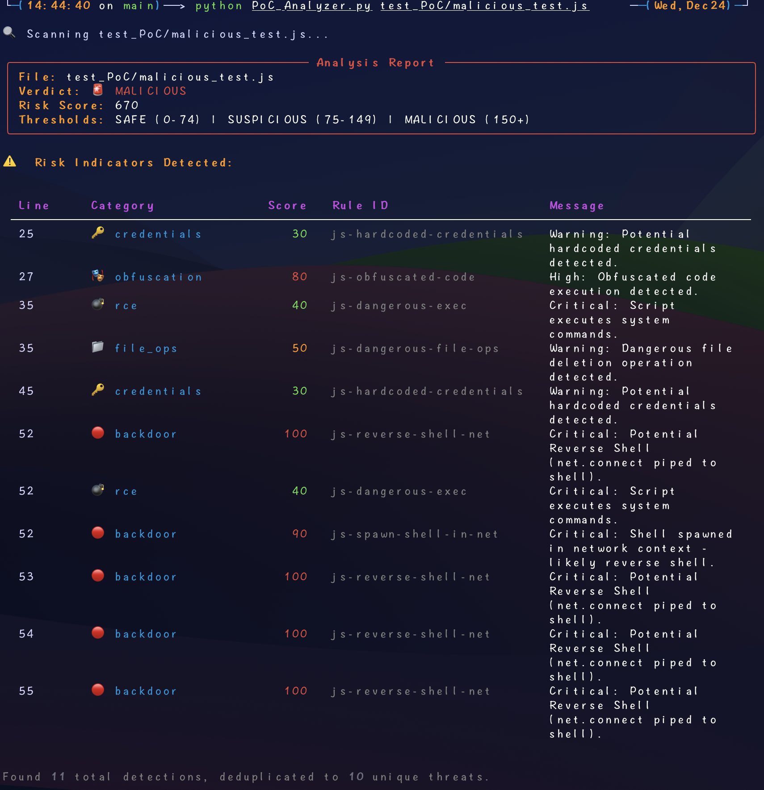

# PoC Analyzer (Proof-of-Concept Malicious Intent Detector)

   

**PoC Analyzer** is a specialized static analysis tool designed for Cybersecurity Researchers, Red Teamers, and Protocol Engineers. 

Unlike traditional SAST tools that search for *vulnerabilities* in code, PoC Analyzer scans for **Malicious Intent**. It is built to validate third-party Proof-of-Concept (PoC) scripts downloaded from GitHub, Exploit-DB, or other public sources, ensuring they do not contain hidden backdoors, reverse shells, or malware droppers before you execute them.

---

## Features

* **Multi-Language Support**: Native support for **Python, Node.js, Go, PHP, Java, C/C++, Shell, Batch, and PowerShell**.
* **Heuristic Scoring Engine**: Calculates a "Risk Score" based on weighted behaviors (e.g., Obfuscation = High Risk, Socket Connection = Low Risk) rather than simple keyword matching.
* **AST-Based Analysis**: Powered by [Semgrep](https://semgrep.dev/), allowing it to understand code structure and detect obfuscated patterns (e.g., `eval(base64...)`) that regex often misses.
* **Smart Deduplication**: Automatically groups duplicate findings to prevent score inflation, ensuring accurate risk assessment.
* **Rich Reporting**: Generates beautiful, easy-to-read terminal reports with clear verdicts (SAFE / SUSPICIOUS / MALICIOUS).

---

## Demo


*Figure: PoC Analyzer detecting a malicious script.*

---

## Project Structure

To ensure the analyzer works correctly, organize your directory as follows:

```text
PoC-Analyzer/
├── PoC_Analyzer.py            # Main Analysis Engine
├── README.md                  # Documentation
├── requirements.txt           # Python dependencies
├── test_samples.zip           # Encrypted test samples (password: infected)
└── rules/                     # Semgrep Rule Definitions
    ├── common.yaml        # Cross-language secrets IoCs
    ├── c.yaml             # C/C++ rules
    ├── php.yaml           # PHP specific rules
    ├── python.yaml        # Python specific rules
    ├── js.yaml            # JavaScript/Node.js rules
    ├── go.yaml            # Go rules
    ├── java.yaml          # Java rules
    ├── shell.yaml         # Bash/Sh rules
    ├── batch.yaml         # Batch/CMD rules
    └── powershell.yaml    # PowerShell rules

```

---

## ⚠️ Test Samples
The test cases are encrypted to prevent antivirus false positives. Unzip test_samples.zip in Sandbox environment with password: `infected` to run the tests.

---

## Installation

### Prerequisites

1. **Clone the repository:**
```bash
git clone https://github.com/Y-T-T/PoC-Analyzer.git
cd PoC-Analyzer
```

2. **Install dependencies:**
```bash
pip install -r requirements.txt
```

## Usage

### 1. Basic Scan (Recommended)

By default, the analyzer scans the target file using all rules found in the local `rules/` directory. It automatically filters rules based on the file extension.

```bash
python PoC_Analyzer.py poc.py
```

### 2. Scan with Specific Configuration

You can specify a custom rule file or a different directory.

```bash
python PoC_Analyzer.py -c rules/js.yaml poc.js
```

### 3. Adjust Sensitivity

The default risk threshold is **150**. You can adjust this to be more aggressive or lenient.

```bash
# Strict mode: Any score above 80 is considered MALICIOUS
python PoC_Analyzer.py -c rules/shell.yaml -t 80 poc.sh
```

---

## Risk Scoring Logic

The analyzer assigns a verdict based on the calculated **Risk Score**.

| Verdict | Icon | Condition | Description |
| --- | --- | --- | --- |
| **SAFE** | ✅ | Score < Threshold / 2 | Low risk. Likely a legitimate PoC or tool. |
| **SUSPICIOUS** | ⚠️ | Score ≥ Threshold / 2 | Contains some dangerous patterns (e.g., system calls), but lacks definitive malicious intent. Manual review recommended. |
| **MALICIOUS** | 🚨 | Score ≥ Threshold | **High Risk.** Clear indicators of backdoor behavior (e.g., Reverse Shell, Obfuscated Execution, Droppers). |

### Scoring Examples

* **Socket Connection (`socket`)**: +10 (Essential for many PoCs)
* **System Command (`os.system`)**: +30 (Common in RCE PoCs)
* **Obfuscation (`base64 decode`)**: +50 (Suspicious)
* **Reverse Shell Pattern**: **+100 (Critical Malicious Indicator)**

*Example:* A script containing `eval()` (+50), `base64` (+50), and a network connection (+10) would score **110**. With a threshold of 100, this would be flagged as **MALICIOUS**.

---

## Supported Languages & Extensions

| Language | Extensions | Key Detection Capabilities |
| --- | --- | --- |
| **Python** | `.py` | Pickle deserialization, Obfuscated Eval, Pip poisoning |
| **JavaScript** | `.js`, `.ts` | Node.js RCE, Prototype Pollution, Reverse Shells |
| **Go** | `.go` | Syscall abuse, Memory manipulation, Binary droppers |
| **C / C++** | `.c`, `.cpp`, `.h` | Shellcode loaders, Process injection, `system()` abuse |
| **PHP** | `.php` | Webshells, Command Injection, File write |
| **Java** | `.java` | Reflection attacks, JNI loading, Runtime execution |
| **Shell** | `.sh` | Reverse Shells, `curl`, `bash`, One-liners |
| **Batch** | `.bat`, `.cmd` | `certutil` downloaders, Firewall tampering, Shadow Copy deletion |
| **PowerShell** | `.ps1`, `.psm1` | Fileless attacks, AMSI Bypass, IEX execution |

---

## Contributing

If you find a new malicious pattern or want to add support for a new language:

1. Fork the repository.
2. Add your new rule to the appropriate YAML file in `rules/`.
3. Ensure your rule includes `metadata` with a `risk_score`.
4. Submit a Pull Request.

**Rule Metadata Format:**

```yaml
metadata:
  risk_score: 80
  category: persistence  # Options: rce, backdoor, obfuscation, dropper, etc.
```

---

## ⚠️ Disclaimer

**This tool is for educational and defensive purposes only.**

Do not use this tool to analyze code you do not have permission to access. The author assumes no liability for any direct or indirect damage caused by the use or misuse of this tool. **Always analyze untrusted PoCs in an isolated Sandbox environment.**

---

**License:** [MIT](LICENSE)