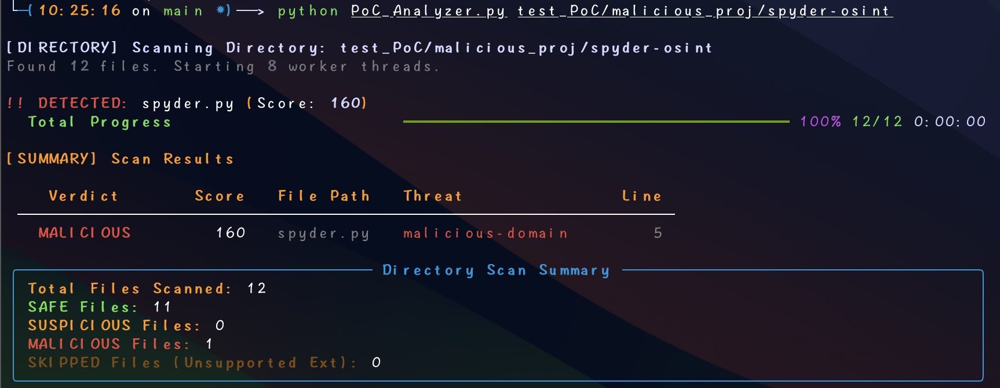
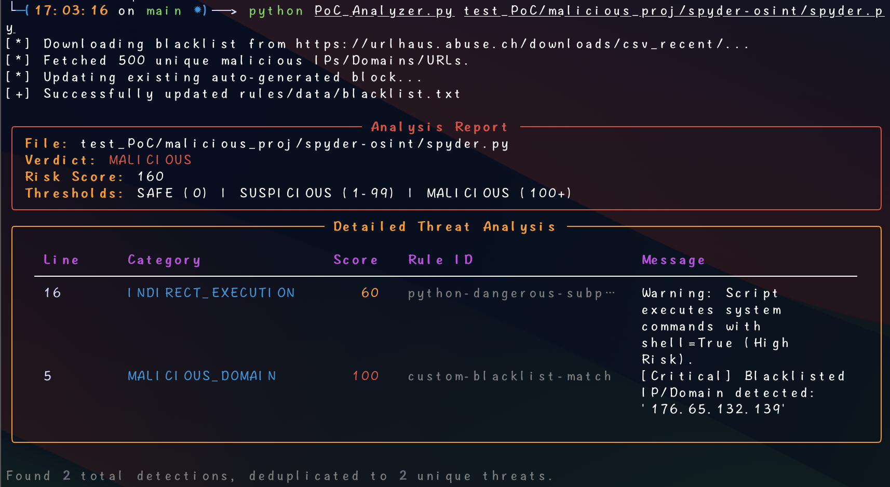

# PoC Analyzer (Proof-of-Concept Malicious Intent Detector)

   

Unlike traditional SAST tools that search for *vulnerabilities* in code, PoC Analyzer scans for **Malicious Intent**. It is built to validate third-party Proof-of-Concept (PoC) scripts downloaded from GitHub, Exploit-DB, or other public sources, ensuring they do not contain hidden backdoors, reverse shells, or malware droppers before you execute them.

---

## Features

* **Multi-Language Support**: Native support for **Python, Node.js, Go, PHP, Java, C/C++, Shell, Batch, and PowerShell**.
* **Heuristic Scoring Engine**: Calculates a "Risk Score" based on weighted behaviors (e.g., Obfuscation = High Risk, Socket Connection = Low Risk) rather than simple keyword matching.
* **AST-Based Analysis**: Powered by [Semgrep](https://semgrep.dev/), allowing it to understand code structure and detect obfuscated patterns (e.g., `eval(base64...)`) that regex often misses.
* **Live Threat Intelligence**: Automatically updates malicious domains/IPs blacklist from [URLHaus](https://urlhaus.abuse.ch/) before every scan, ensuring detection of the latest C2 infrastructure.
* **Smart Deduplication**: Automatically groups duplicate findings to prevent score inflation, ensuring accurate risk assessment.
* **Rich Reporting**: Generates beautiful, easy-to-read terminal reports with clear verdicts (SAFE / SUSPICIOUS / MALICIOUS).

---

## Demo


*Figure: PoC Analyzer detecting a malicious script in directory.*


*Figure: Detailed threat analysis for a single file.*

---

## Rules Path

The default rules are organized as follows:

```text
└── rules/                 # Semgrep Rule Definitions
    ├── common.yaml        # Cross-language secrets IoCs
    ├── c.yaml             # C/C++ rules
    ├── php.yaml           # PHP specific rules
    ├── python.yaml        # Python specific rules
    ├── js.yaml            # JavaScript/Node.js rules
    ├── go.yaml            # Go rules
    ├── java.yaml          # Java rules
    ├── shell.yaml         # Bash/Sh rules
    ├── batch.yaml         # Batch/CMD rules
    └── powershell.yaml    # PowerShell rules

```

---

## Test Samples
The test cases are encrypted to prevent antivirus false positives. Unzip test_samples.zip in Sandbox environment with password: `infected` to run the tests.

---

## Docker Usage (Recommended)

Running PoC Analyzer in an isolated container is the safest way to handle potential malicious samples and avoids local dependency issues.

### 1. Clone the repository:
```bash
git clone https://github.com/Y-T-T/PoC-Analyzer.git
cd PoC-Analyzer
```

### 2. Build the Image

Build the Docker image from the source directory.

> **Note:** Ensure `test_samples.zip` exists in the directory before running the build command.

```bash
docker build -t poc-analyzer .
```

### 3. Run Scenarios

**Scenario A: View Help (Default)**
Running the container without arguments will display the help menu.

```bash
docker run --rm poc-analyzer
```

**Scenario B: Scan Internal Test Samples**
The image comes with pre-packaged test samples (extracted during the build process). You can test the analyzer against them immediately.

```bash
docker run --rm poc-analyzer test_PoC/malicious_test.js
```

**Scenario C: Scan Local Files (Recommended)**
To scan files on your host machine, mount your current directory (`$(pwd)`) to a volume inside the container (e.g., `/scan`).

```bash
# Scan a specific file
docker run --rm -v "$(pwd):/scan" poc-analyzer /scan/poc.py

# Scan an entire directory
docker run --rm -v "$(pwd):/scan" poc-analyzer /scan/
```

---

## Local Installation

If you prefer running it natively:

1. **Clone the repository:**
```bash
git clone https://github.com/Y-T-T/PoC-Analyzer.git
cd PoC-Analyzer
```

2. **Install dependencies:** Ensure you have Python 3.11+ and Semgrep installed.
```bash
pip install -r requirements.txt
```

3. **Run the analyzer:** See the usage examples below.

## Advanced Usage

### 1. Basic Scan

By default, the analyzer scans the target file using all rules found in the local `rules/` directory. It automatically filters rules based on the file extension.

```bash
python PoC_Analyzer.py poc.py
```

> **Tip:** **File Mode vs Directory Mode**
> - **File Mode (`poc.py`):** Displays detailed risk analysis, including specific Rule IDs and matched code snippets. Use this for deep investigation.
> - **Directory Mode (`ws/`):** Displays a high-level summary dashboard with progress bars and efficient threat overview.

### 2. Scan with Specific Configuration

You can specify a custom rule file or a different directory.

```bash
python PoC_Analyzer.py -c rules/js.yaml poc.js
```

### 3. Adjust Sensitivity

The default risk threshold is **100**. You can adjust this to be more aggressive or lenient.

```bash
# Strict mode: Any score above 80 is considered MALICIOUS
python PoC_Analyzer.py -c rules/shell.yaml -t 80 poc.sh
```

### 4. Deep Scan

By default, the analyzer only uses rules relevant to the file's extension (e.g., `.js` files are scanned with `js.yaml`). To scan a file against **ALL** rules (useful for polyglot files or embedded scripts like PowerShell inside JavaScript), use the `--all-rules` flag.

```bash
python PoC_Analyzer.py --all-rules poc.js
```

### 5. Performance Tuning (Multi-threading)

For scanning large directories, you can increase the number of worker threads. The tool automatically caps this at your system's CPU core count to prevent freezing.

```bash
# Use 8 threads to scan a large project
python PoC_Analyzer.py -w 8 test_PoC/malicious_proj/
```

### 6. Blacklist Update Configuration

The tool automatically fetches the latest malicious URLs from URLHaus. You can control how many recent entries to fetch (default: 500) to balance startup speed and coverage.

```bash
# Fetch top 1000 malicious domains for better coverage
python PoC_Analyzer.py -m 1000 poc.py
```

---

## Risk Scoring Logic

The analyzer assigns a verdict based on the calculated **Risk Score**.

| Verdict |  Condition | Description |
| --- | --- | --- |
| **SAFE** | Score = 0 | Clean. No suspicious indicators found. |
| **SUSPICIOUS** | Score > 0 | Contains some potential risk factors (e.g., system calls, network usage). Manual review recommended. |
| **MALICIOUS** | Score ≥ Threshold | **High Risk.** Clear indicators of backdoor behavior (e.g., Reverse Shell, Obfuscated Execution, Droppers). |

### Scoring Examples

* **Socket Connection (`socket`)**: +10 (info/network)
* **System Command (`os.system`)**: +60 (High Risk - Direct shell execution)
* **Obfuscation (`base64 decode`)**: +80 (High Risk - Common evasion)
* **Reverse Shell Pattern**: **+100 (Critical Malicious Indicator)**

*Example:* A script containing `eval(base64...)` (+80) and a system command (+60) would score **140**. With a threshold of 100, this would be flagged as **MALICIOUS**.

---

## Supported Languages & Extensions

| Language | Extensions | Key Detection Capabilities |
| --- | --- | --- |
| **Python** | `.py` | Pickle deserialization, Obfuscated Eval, Pip poisoning |
| **JavaScript** | `.js`, `.ts` | Node.js RCE, Prototype Pollution, Reverse Shells |
| **Go** | `.go` | Syscall abuse, Memory manipulation, Binary droppers |
| **C / C++** | `.c`, `.cpp`, `.h` | Shellcode loaders, Process injection, `system()` abuse |
| **PHP** | `.php` | Webshells, Command Injection, File write |
| **Java** | `.java` | Reflection attacks, JNI loading, Runtime execution |
| **Shell** | `.sh` | Reverse Shells, `curl`, `bash`, One-liners |
| **Batch** | `.bat`, `.cmd` | `certutil` downloaders, Firewall tampering, Shadow Copy deletion |
| **PowerShell** | `.ps1`, `.psm1` | Fileless attacks, AMSI Bypass, IEX execution |

---

## Contributing

If you find a new malicious pattern or want to add support for a new language:

1. Fork the repository.
2. Add your new rule to the appropriate YAML file in `rules/`.
3. Ensure your rule includes `metadata` with a `risk_score`.
4. Submit a Pull Request.

**Rule Metadata Format:**

```yaml
metadata:
  risk_score: 80
  category: persistence  # Options: rce, backdoor, obfuscation, dropper, etc.
```

---

## Disclaimer

**This tool is for educational and defensive purposes only.**

1.  **No Warranty**: The software is provided "as is", without warranty of any kind. The author assumes no liability for any direct or indirect damage caused by the use or misuse of this tool.
2.  **False Sense of Security**: Static analysis cannot guarantee 100% accuracy. A file marked as "SAFE" may still contain undetected malicious code. **Never execute untrusted PoCs based solely on this tool's verdict.**
3.  **Sandbox Required**: Always analyze and test untrusted PoCs in an isolated Sandbox environment (e.g., VM, Docker).

---

**License:** [Apache-2.0](LICENSE)